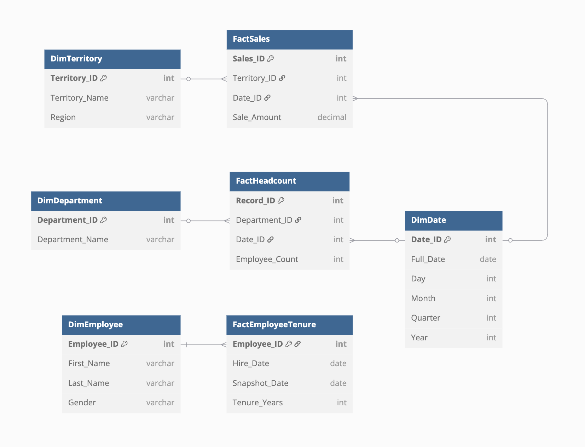

# AdventureWorks ETL Pipeline

This ETL pipeline extracts data from an AdventureWorks OLTP database, transforms it into a star schema model, and loads it into a data warehouse.

## Project Structure

- `extract.py` - Extracts data from OLTP database to staging
- `transform.py` - Transforms staging data into star schema structure
- `load.py` - Loads transformed data into the data warehouse with proper relationships
- `run_etl.py` - Python script to run the entire ETL pipeline
- `run_etl.sh` - Bash script to run the entire ETL pipeline

## Star Schema Design

The data warehouse uses a star schema with the following structure:


### Dimension Tables
- `dim_date` - Date dimension with date attributes
- `dim_territory` - Geographic sales territories 
- `dim_department` - Company departments
- `dim_employee` - Employee information

### Fact Tables
- `fact_sales` - Sales transactions with amounts
- `fact_employee_tenure` - Employee tenure calculations 
- `fact_headcount` - Department headcount metrics

## Running the ETL Pipeline

### Option 1: Using Python Script

```bash
python run.py
```

### Option 2: Using Bash Script

```bash
./run.sh
```

### Option 3: Running Each Step Manually

```bash
# Step 1: Extract
python extract.py

# Step 2: Transform
python transform.py

# Step 3: Load
python load.py
```

### Option 4: Scheduled Execution with Cron

The ETL pipeline can be scheduled to run automatically using cron jobs:

1. Make sure the scripts are executable:
   ```bash
   chmod +x run.sh cron_etl.sh
   ```

2. Edit your crontab:
   ```bash
   crontab -e
   ```

3. Add a scheduling pattern (examples):
   ```
   # Run daily at midnight
   0 0 * * * /Users/azhar/Developer/data-lakehouse-etl/cron_etl.sh
   
   # Run every Monday at 2 AM
   0 2 * * 1 /Users/azhar/Developer/data-lakehouse-etl/cron_etl.sh
   ```

See `crontab_examples.txt` for more scheduling patterns including short intervals for demonstration purposes.

## Database Connection Configuration

Database connection strings are defined in `.env` file and loaded by `db_config.py`.

## Data Mapping

The ETL pipeline implements the following logical data mapping:

| Source Table              | Source Column       | Source Data Type | Target Table        | Target Column    | Target Data Type | Transformation                        |
|---------------------------|---------------------|-----------------|--------------------|--------------------|-----------------|---------------------------------------|
| SalesOrderHeader          | SalesOrderID        | int             | FactSales          | Sales_ID           | int             | Direct copy                           |
| SalesOrderHeader          | TerritoryID         | int             | FactSales          | Territory_ID       | int             | Direct copy                           |
| SalesOrderHeader          | OrderDate           | datetime        | FactSales          | Date_ID            | int             | Lookup in DimDate using OrderDate     |
| SalesOrderHeader          | TotalDue            | money           | FactSales          | Sale_Amount        | decimal         | Cast to decimal                       |
| SalesTerritory            | TerritoryID         | int             | DimTerritory       | Territory_ID       | int             | Direct copy                           |
| SalesTerritory            | Name                | nvarchar        | DimTerritory       | Territory_Name     | varchar         | Convert to varchar                    |
| SalesTerritory            | Group               | nvarchar        | DimTerritory       | Region             | varchar         | Convert to varchar                    |
| Department                | DepartmentID        | smallint        | DimDepartment      | Department_ID      | int             | Cast to int                           |
| Department                | Name                | nvarchar        | DimDepartment      | Department_Name    | varchar         | Convert to varchar                    |
| Employee                  | EmployeeID          | int             | DimEmployee        | Employee_ID        | int             | Direct copy                           |
| Person                    | FirstName           | nvarchar        | DimEmployee        | First_Name         | varchar         | Join via BusinessEntityID             |
| Person                    | LastName            | nvarchar        | DimEmployee        | Last_Name          | varchar         | Join via BusinessEntityID             |
| Employee                  | Gender              | nchar           | DimEmployee        | Gender             | varchar         | Cast to varchar                       |
| Employee                  | EmployeeID          | int             | FactEmployeeTenure | Employee_ID        | int             | Direct copy                           |
| Employee                  | HireDate            | datetime        | FactEmployeeTenure | Hire_Date          | date            | Cast to date                          |
| [System date]             | —                   | —               | FactEmployeeTenure | Snapshot_Date      | date            | Current date at ETL runtime           |
| Employee                  | HireDate            | datetime        | FactEmployeeTenure | Tenure_Years       | int             | DATEDIFF(YEAR, HireDate, Snapshot_Date) |
| EmployeeDepartmentHistory | DepartmentID        | smallint        | FactHeadcount      | Department_ID      | int             | Cast to int                           |
| EmployeeDepartmentHistory | StartDate           | datetime        | FactHeadcount      | Date_ID            | int             | Lookup in DimDate using StartDate     |
| EmployeeDepartmentHistory | EmployeeID          | int             | FactHeadcount      | Employee_Count     | int             | COUNT() with GROUP BY                 |
| — (calendar logic)        | —                   | —               | DimDate            | Date_ID            | int             | Surrogate key (YYYYMMDD format)       |
| —                         | OrderDate, HireDate | datetime        | DimDate            | Full_Date          | date            | Distinct dates from all source fields |
| —                         | —                   | —               | DimDate            | Day                | int             | DAY(Full_Date)                        |
| —                         | —                   | —               | DimDate            | Month              | int             | MONTH(Full_Date)                      |
| —                         | —                   | —               | DimDate            | Quarter            | int             | DATEPART(QUARTER, Full_Date)          |
| —                         | —                   | —               | DimDate            | Year               | int             | YEAR(Full_Date)                       |

## Requirements

Required Python packages:
- pandas
- sqlalchemy
- psycopg2

Install dependencies with:
```bash
pip install -r requirements.txt
```
